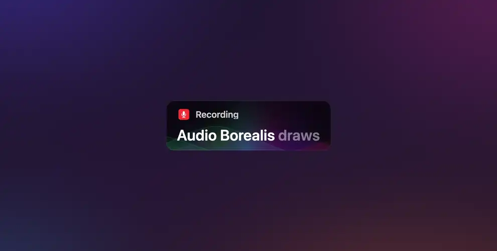

# audio-borealis


  
[](https://github.com/daformat)
[](https://twitter.com/daformat)

<a href="https://hello-mat.com/design-engineering/audio-borealis">
  
</a>

A glow that listens. Seven soft lobes fan out from the bottom edge of a box, each on a band of the voice, and slide
sideways while someone is talking. Over them, five translucent hills, one per band, each filled with a color off the
hue wheel, rise as their band is heard. Silence is nothing.

It is the Audio Borealis from [Subtitles](https://subtitles-live.com), the live captions app for the Mac, lifted out of
the app and its landing page as a package: a driver that turns a loudness and five bands into a frame, a painter that
puts the frame on a canvas in plain 2D calls, a mock voice for when there is no sound to read, and a microphone source
for when there is. Every number is the app's.

Zero dependencies, no framework. The painter needs a 2D canvas, which every browser has; the driver, the hills and the
mock voice are pure functions and run anywhere, Node included, which is where the tests run.

## Installation

```bash
npm install @daformat/audio-borealis
```

```bash
yarn add @daformat/audio-borealis
```

```bash
pnpm add @daformat/audio-borealis
```

```bash
bun add @daformat/audio-borealis
```

```bash
deno add npm:@daformat/audio-borealis
```

## Demo

https://hello-mat.com/design-engineering/audio-borealis

## Usage

Attach it to an element and give it something to listen to. The canvas is laid under the element's content, on the
element's own corners, and sized with it.

```ts
import { attachBorealis, createMockVoice } from "@daformat/audio-borealis";

const box = document.querySelector<HTMLElement>(".caption")!;
const voice = createMockVoice();

const glow = attachBorealis(box, {
  look: "rainbow",
  strength: "medium",
  // Once a frame: the seconds since the last one, and the levels back.
  source: (dt) => voice.read(dt, isSomeoneTalking()),
});

glow.setLook("northernLights");
glow.setStrength("subtle");
glow.destroy();
```

The element has to be able to hold a canvas under its content, so it is given `position: relative` if it is static,
and `isolation: isolate` if it does not already form a stacking context. Nothing else about it is touched. Pass a
`canvas` of your own to place it yourself and leave the element alone.

### With the microphone

```ts
import {
  attachBorealis,
  createMicrophoneSource,
} from "@daformat/audio-borealis";

// From a click: the browser asks for the microphone, and it can say no.
button.addEventListener("click", async () => {
  const mic = await createMicrophoneSource();
  const glow = attachBorealis(box, { source: () => mic.read() });
  // later
  await mic.stop();
  glow.destroy();
});
```

### With sound you already have

Anything that goes through Web Audio can go through an `AnalyserNode`:

```ts
import { attachBorealis, createAnalyserSource } from "@daformat/audio-borealis";

const analyser = audioContext.createAnalyser();
analyser.fftSize = 2048;
audioContext
  .createMediaElementSource(video)
  .connect(analyser)
  .connect(audioContext.destination);

const source = createAnalyserSource(analyser);
attachBorealis(box, { source: () => source.read() });
```

The loudness is the RMS of the waveform and the bands are the spectrum cut at `BAND_EDGES`, each averaged into 0..1
between the analyser's own floor and ceiling. The driver scales both to their running peaks, so a quiet input fills
the box the way a loud one does.

### Feeding it yourself

Without a `source`, push the levels as you get them. A reading holds for 120 ms and then counts as silence, so a
stream that stops goes quiet on its own.

```ts
const glow = attachBorealis(box);
worklet.port.onmessage = ({ data }) => {
  glow.feed({ loudness: data.rms, bands: data.bands });
};
```

`bands` is optional. Without it, the driver shapes five of its own out of the loudness, so a plain level meter is
enough to drive it.

### Looks and strengths

The four looks are the app's menu: `rainbow` takes the whole wheel, `northernLights` the green-to-violet half,
`autumn` a quarter from magenta round to orange, and `whiteHaze` is white alone. A look of your own is a color mode and
where on the wheel it sits:

```ts
attachBorealis(box, {
  look: { colorMode: "spectrum", hueStart: 190, hueWidth: 60 }, // the blues
  strength: 0.8, // or "strong" | "medium" | "subtle": 1, 0.5, 0.35
});
```

### The knobs

Everything the app tunes is in `BorealisConfig`, and `configure` changes any of it in place:

```ts
glow.configure({ flow: 120, reach: 2.2, idle: 0.3 });
```

`idle` is worth knowing about: above 0 the glow breathes on its own in silence, which the app never does but a page
with nothing to say might want.

### Your own canvas, or your own renderer

The pieces come apart. The driver is a loudness in and a frame out, and the frame carries everything the painter
needs, so you can paint it yourself, on a canvas of your own size, or in WebGL, or as SVG:

```ts
import { createDriver, curves, paintFrame } from "@daformat/audio-borealis";

const driver = createDriver();
const scratch = document.createElement("canvas");

const tick = (dt: number) => {
  const frame = driver.step(dt, { loudness, bands });
  // frame.glow, frame.lobeX, frame.lobeAmplitude, frame.hue, frame.bands …
  paintFrame(ctx, scratch, frame, { width, height, radius: 12, fontSize: 30 });
  // or the hills alone, as points to draw with whatever you like
  const hills = curves(frame, width, height, 1, 1);
};
```

## How it works

### The driver

The loudness is gained (`sensitivity`, times a base gain of 5), gated at `threshold`, and rounded off above it with a
soft knee, so a shout tops out instead of clipping:

```
t = (raw − threshold) / (1 − threshold)
level = (1 − e^(−3t)) / (1 − e^(−3))
```

Each band goes through the same gate, at 0.6 of the threshold. With `autoGain` on, every level is divided by its own
running peak, which decays over `autoGainRelease` seconds and never falls under `autoGainFloor`: a quiet voice reaches
the top of the box, and silence is not amplified into a shout. Then a one-pole follower with a fast `attack` and a slow
`release`, so the glow snaps up on a syllable and settles after it.

The rise, which everything else is scaled by, is the level to the power of `curve`. At the default 0.6 the glow comes
up fast at low levels and eases toward the top. The lobes slide by `flow` units a second times the rise, so they move
while a voice is heard and hold in silence, and each fades out over the last few units of its span before it comes
back on the other side.

### The lobes

Seven of them, fanned out from the middle of the bottom edge, in points at the app's size. The center one stands on the
lows, its neighbors on the mids, the outer pair on the highs, and the far pair on the low mids:

| Lobe   | x    | w   | h   | Band |
| ------ | ---- | --- | --- | ---- |
| center | 0    | 74  | 46  | 0    |
| inner  | ±36  | 54  | 40  | 2    |
| outer  | ±72  | 48  | 32  | 4    |
| far    | ±108 | 42  | 26  | 1    |

Each one's height is `0.6 + 0.7 × band`, so a lobe never quite disappears while the glow is up, and rises by more than
double when its band is loud.

### The hills

`curveCount` curves, each a bell over the width, standing on the bands from low to high. The center-most rests in the
middle and the rest alternate outward, the outermost at `curveSpan` of the width from the center. A hill's height is
`0.15 + 0.85 × band` of a ceiling that rises with the glow and never takes more than `curveCeiling` of the box. They
wander sideways a little as the lobes flow. The bell is exactly 0 at its ends, which is what lets a hill be clipped and
filled without a seam.

### The colors

Seven shares of the wheel, `[0.94, 0.56, 0.76, 0.40, 0.08, 0.65, 0.49]`, shuffled so that neighbors contrast, spread
over `hueWidth` degrees from `hueStart`. The hills take the first ones, low band to high. The whole set drifts
`hueRange` degrees either side of where it started, out and back over `hueDuration` seconds on a cosine, so the colors
are never quite the same twice and never jump.

### The painter

Two soft layers of lobes, a wide faint one and a tighter brighter one. Each is built on a scratch canvas: the seven
lobes as radial gradients squashed into ellipses, then an elliptical mask laid over them with `destination-in`, so the
layer fades out before the lobes themselves would, then the whole thing drawn onto the box at the layer's opacity
times the glow. Over them, each hill is filled from the bottom edge to its curve, the fill fading toward the crest, and
its crest stroked at one pixel above the base line. Everything is clipped to the box's corners.

That is all plain 2D: gradients, clips, `destination-in`, `lighter` when the hills are set to add. No filters, no
`OffscreenCanvas`, no `roundRect`, so Chrome, Safari and Firefox draw the same picture, and the whole thing costs well
under a millisecond a frame on a caption-sized box.

### The mock voice

A voice that is not there, close enough to one that the meter would read the same. Syllables of uneven length and
loudness, some stressed, laid end to end with a short gap now and then where a word ends, each with a spectral shape of
its own, a vowel low and in the mids and a consonant higher, and a third of them opening on a burst of highs, a
sibilant. It is deterministic in time, from a hash, so it repeats and stores nothing: eight syllables fill a cycle of
1.7 seconds, and the cycle's index reseeds them. `createMockVoice` adds a clock that starts over at each stretch of
speech, so every sentence is said the same way, to the same peak.

## API

### `attachBorealis(element, options?)`

The glow on an element. Returns a `Borealis`.

| Option          | Type                           | Default     | What it does                                                                     |
| --------------- | ------------------------------ | ----------- | -------------------------------------------------------------------------------- |
| `source`        | `(dt, time) => Levels \| null` |             | The levels each frame. Leave it out to push them with `feed()`.                  |
| `look`          | `LookName \| Look`             | `"rainbow"` | Where the colors come from.                                                      |
| `strength`      | `StrengthName \| number`       | `"medium"`  | The whole effect's opacity.                                                      |
| `config`        | `Partial<BorealisConfig>`      |             | Any knobs, over the app's defaults and under the look and strength.              |
| `scaleY`        | `number`                       | `1`         | An extra vertical factor, for a box drawn smaller than its type would have it.   |
| `maxPixelRatio` | `number`                       | `3`         | The most device pixels per CSS px the canvas is drawn at.                        |
| `onScreenOnly`  | `boolean`                      | `true`      | Run only while the element is on screen.                                         |
| `feedHold`      | `number`                       | `120`       | Milliseconds a fed reading holds before it counts as silence.                    |
| `canvas`        | `HTMLCanvasElement`            |             | A canvas of your own, placed as you like, instead of one laid under the content. |
| `className`     | `string`                       |             | A class for the canvas that is made.                                             |

```ts
type Borealis = {
  readonly element: HTMLElement;
  readonly canvas: HTMLCanvasElement;
  readonly driver: Driver;
  /** The last frame painted, or null before the first. */
  readonly frame: BorealisFrame | null;
  readonly paused: boolean;
  feed: (levels: Levels) => void;
  setSource: (source: Source | null) => void;
  setLook: (look: LookName | Look) => void;
  setStrength: (strength: StrengthName | number) => void;
  configure: (config: Partial<BorealisConfig>) => void;
  pause: () => void;
  resume: () => void;
  /** Back to silence, at once. */
  reset: () => void;
  /** Take the canvas out and stop for good. */
  destroy: () => void;
};
```

One frame loop serves every glow on the page, and it runs only while a glow is awake: on screen, in a visible tab, and
either reading a source or still fading. A glow with nothing to do costs nothing. `pause()` holds it where it is.

### `createDriver(config?)`

A loudness in, a frame out. `config` is a `BorealisConfig`, the app's defaults when left out, and it is kept by
reference: change it in place, or through `applyLook(config, look)`.

```ts
type Driver = {
  readonly config: BorealisConfig;
  /** The followed levels and the clocks, for a readout. */
  readonly state: Readonly<DriverState>;
  step: (dt: number, levels: Levels) => BorealisFrame;
  reset: () => void;
};

type Levels = {
  /** The RMS of the waveform, or anything in 0..1 that rises with the voice. */
  loudness: number;
  /** Five bands, low to high, each in 0..1. Optional. */
  bands?: readonly number[] | null;
};
```

### `paintFrame(ctx, scratch, frame, box)`

A frame onto a 2D context. `scratch` is a second canvas of the same size the masked layers are built on, `box` is
`{ width, height, radius, fontSize, scaleY? }` in CSS px, and the context is expected to carry the device pixel ratio
as its transform. `isBlank(frame)` tells you whether there is anything to paint.

### `curves(frame, width, height, scaleX, scaleY, samples?)`

The hills of a frame as points, `[x, y]` with x from the left edge and y the height above the bottom edge, one array
per hill. `curveOffset` and `curveBand` are the placement rules on their own.

### The sources

- **`createMockVoice()`** — `{ read(dt, speaking), time, reset() }`. The voice from where it left off while `speaking`,
  silence otherwise, starting over at each stretch of speech.
- **`mockVoice(t, speaking)`** — the same voice as a pure function of time.
- **`createAnalyserSource(analyser, { edges? })`** — `{ read() }` over an `AnalyserNode`, or anything with its shape.
- **`createMicrophoneSource(options?)`** — asks for the microphone and returns an analyser source with `stream`,
  `context`, `analyser` and `stop()`. Rejects as `getUserMedia` does.
- **`rms(samples)`** and **`bandLevels(spectrum, sampleRate, fftSize, minDb, maxDb, edges?)`** — the two readings on
  their own, for a source of your own. `BAND_EDGES` is `[0, 300, 600, 1200, 2400, 8000]` Hz.

### The knobs

`defaults()` returns a fresh `BorealisConfig` at the app's values.

| Knob               | Default      | What it does                                                                  |
| ------------------ | ------------ | ----------------------------------------------------------------------------- |
| `sensitivity`      | `3`          | Gain on the loudness, over a base gain of 5.                                  |
| `threshold`        | `0.06`       | The noise gate, on the gained loudness.                                       |
| `curve`            | `0.6`        | The rise's curve: below 1 the glow comes up fast and then eases.              |
| `autoGain`         | `true`       | Scale every level to its own running peak.                                    |
| `autoGainFloor`    | `0.3`        | The lowest the running peak may fall.                                         |
| `autoGainRelease`  | `4`          | Seconds for the running peak to decay.                                        |
| `attack`           | `0.05`       | Seconds to rise toward a louder target.                                       |
| `release`          | `0.2`        | Seconds to fall toward a quieter one. The bands take 1.15 times this.         |
| `idle`             | `0`          | How much the glow breathes on its own in silence.                             |
| `breatheDuration`  | `5.2`        | Seconds per breath.                                                           |
| `reach`            | `1.7`        | The glow's height at full rise.                                               |
| `spread`           | `1.05`       | How much wider the glow gets at full rise, over a base of 0.85.               |
| `flow`             | `60`         | How fast the lobes slide while a voice is heard, in points a second.          |
| `lobeSpacing`      | `0.85`       | How far apart the lobes sit, 1 for the app's spacing.                         |
| `hueRange`         | `24`         | How far the hue drifts either side of where it started, in degrees.           |
| `hueDuration`      | `12`         | Seconds for the hue to drift out and back.                                    |
| `hueStart`         | `0`          | Where the colors' share of the wheel begins, in degrees.                      |
| `hueWidth`         | `360`        | How much of the wheel the seven colors share.                                 |
| `saturation`       | `0.85`       | The colors' saturation.                                                       |
| `colorMode`        | `"spectrum"` | `"spectrum"`, `"white"` or `"black"`.                                         |
| `opacity`          | `0.5`        | The whole effect's opacity. The strengths set this.                           |
| `glowOpacity`      | `1`          | The lobes' own opacity, under `opacity`. 0 leaves the hills alone.            |
| `bend`             | `60`         | How far the glow is lifted at full rise, in points.                           |
| `curveCount`       | `5`          | How many hills stand over the lobes.                                          |
| `curveOpacity`     | `0.2`        | The hills' fill, at the bottom edge.                                          |
| `curveEdge`        | `0.35`       | The line along each hill's crest.                                             |
| `curveFade`        | `0.35`       | How much of the fill is left at the crest.                                    |
| `curveBlend`       | `"normal"`   | `"normal"` paints the hills over the lobes, `"additive"` adds them.           |
| `curvePosition`    | `0.25`       | How high the hills stand against the lobes' height.                           |
| `curveCeiling`     | `0.55`       | The most of the box's height a hill may take.                                 |
| `curveBase`        | `0`          | How much the hills' base lifts with the glow.                                 |
| `curveOffset`      | `-1.5`       | Where the hills' base sits against the bottom edge, in points.                |
| `curveShape`       | `1.75`       | The hills' profile: 2 is a bell, higher is flatter on top.                    |
| `curveSpread`      | `0.87`       | How wide each hill's bell is over its half width.                             |
| `curveSpan`        | `0.5`        | How far from the center the outermost hills rest, as a share of the width.    |
| `curveWidthCentre` | `0.55`       | A center hill's half width, as a share of the box's width.                    |
| `curveWidthEdge`   | `0.32`       | An outermost hill's half width, as a share of the box's width.                |
| `curveWander`      | `0.084`      | How far the hills wander sideways as the lobes flow, as a share of the width. |

### Types

```ts
import type {
  AttachOptions,
  Borealis,
  BorealisConfig,
  BorealisFrame,
  ColorMode,
  Curve,
  CurveBlend,
  Driver,
  DriverState,
  Levels,
  Look,
  LookName,
  MicrophoneSource,
  MockVoice,
  PaintBox,
  PaintContext,
  Rgb,
  Source,
  StrengthName,
} from "@daformat/audio-borealis";
```

`BorealisFrame` is what the driver hands the painter each step: the followed `level` and `bands`, the `glow` (the
rise, 0..1), the `height` and `width` factors, the `hue` drift in degrees, the `lift`, the `flow` (0..1 of a wrap), and
each lobe's `lobeX` and `lobeAmplitude`.

## License

[Zero-Clause BSD](./LICENSE) © Mathieu Jouhet
